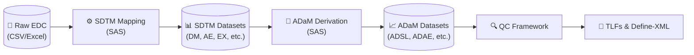

# 🧬 CDISC-Inspired Clinical Data Pipeline (Raw to SDTM/ADaM)

An educational end-to-end clinical data pipeline demonstrating the transformation of raw, unstructured Electronic Data Capture (EDC) exports into **CDISC SDTM (Study Data Tabulation Model)** and **ADaM (Analysis Data Model)** datasets. 

This project is designed to showcase clinical data engineering, defensive SAS programming, and statistical analysis dataset derivation, culminating in a structural Define-XML v2.0 metadata prototype.

## Portfolio evidence — 30-second review

| Question | Evidence in this repository |
|---|---|
| **What problem does it address?** | Converts inconsistent, EDC-style source extracts into traceable SDTM-inspired domains and analysis-ready ADaM datasets. |
| **What goes in?** | Reproducible **synthetic** demographics, exposure, adverse-event, medication, laboratory, vital-sign, ECG, visit, and disposition data generated under [`scripts/`](scripts/). |
| **What comes out?** | SDTM-inspired domains, ADSL/ADAE/ADLB/ADVS/ADTTE, portfolio TLFs, a QC report, and a structural [`Define-XML v2.0 prototype`](tlfs/define.xml). |
| **How is it verified?** | Defensive SAS QC can stop the pipeline on critical findings; versioned Python contract tests and the [GitHub Actions quality gate](.github/workflows/quality.yml) check raw-data and SAS-program invariants. |
| **What can a reviewer inspect quickly?** | [`tests/`](tests/), [`qc/`](qc/), the generated [`QC report`](tlfs/qc_report.rtf), [`Table 1`](tlfs/tlf_table1.rtf), and [`Figure 1`](tlfs/tlf_figure1.rtf). |
| **What are the limits?** | Educational portfolio implementation using synthetic data and mock terminology dictionaries. It has not undergone formal Pinnacle 21 validation, regulatory submission validation, or production qualification. |

The complete reproduction path is documented in [How to Reproduce this
Pipeline](#how-to-reproduce-this-pipeline). Results are evidence of internal
consistency and traceability for the supplied synthetic study—not evidence of
regulatory acceptance.

## 🚀 Quick Start

Get the project locally to review the SAS macros and Python scripts:

```bash
# 1. Clone the repository
git clone https://github.com/MrCosta77/Clinical-data-to-CDISC.git
cd Clinical-data-to-CDISC

# 2. Set up a virtual environment (for Python data generators)
python -m venv venv
venv\Scripts\activate  # Windows

# 3. Install Python dependencies
pip install pandas numpy

# 4. Generate the raw synthetic EDC data
python scripts/generate_raw_edc.py

# 5. Run the SAS pipeline
# Open run_all.sas in SAS Studio or SAS Enterprise Guide and run it.
```

## 📐 Architecture Flow



## 🧠 Core Engineering Philosophy
* **Educational Terminology Mapping:** Utilizes mock dictionaries to simulate MedDRA and CDISC Controlled Terminology mapping.
* **Defensive SAS Programming:** Extensive use of dynamic type-checking (`vtype`), `anydtdte` informats, and robust ISO 8601 date conversions (`is8601da.`) to prevent data loss from unstructured EDC formats.
* **Advanced Derivations:** Complex logic for ongoing clinical events, baseline flagging (`ABLFL`), and temporal treatment-emergent derivations (`TRTEMFL`).

## 🛠️ Development Milestones

### Phase 1: SDTM Transformation
- **DM:** Core subject and site identifiers, CDISC race terminology, ISO 8601 date standardizations, and Randomization Arms.
- **VS & LB:** Horizontal-to-vertical unpivoting (wide to long), conditional dictionary mapping, and parameter standardization.
- **AE, EX & CM:** Sequential numbering, clinical exposure mapping, and concomitant medications standardization. Ongoing CM records retain a missing clinical end date and use `CMENTPT=DM.RFENDTC` to anchor `CMENRTPT=ONGOING` at the existing end-of-participation assessment boundary.
- **MH & EG:** Retrospective medical history mapping and electrocardiogram signal standardization.
- **SV & DS:** Actual subject visits and final study disposition, tied to the subject reference period in DM.
- **Architecture Validation:** Implementation of `retain` statements to ensure strict CDISC column ordering (Identifiers first).

### Phase 2: ADaM Derivation & Clinical Logic
- **ADSL (Subject-Level):** Numeric analysis dates, demographic math (AGE), Treatment Duration, and Population Flags (ITTFL, SAFFL).
  - *Note on Misallocation:* The synthetic generator deliberately introduces treatment deviations (~5%) to realistically demonstrate complex derivations between the Intent-to-Treat (ITT) and Safety populations.
  - *Screening Data:* Screening assessments such as vital signs are retained for screen failures because they were genuinely collected. EX contains only dosed participants, while ADSL population flags (`ITTFL` and `SAFFL`) control their inclusion in the corresponding analyses.
- **ADVS (Vital Signs):** Exact source-record Baseline derivations (`ABLFL`) with `SRCSEQ` traceability, Change from Baseline calculations, and a QC gate for same-day ambiguity when collection time is unavailable.
- **ADAE (Adverse Events):** Treatment-emergent classification (`TRTEMFL`) and the first treatment-emergent occurrence per subject and decoded term (`AOCCFL`).
- **ADLB (Laboratory Analysis):** Exact source-record Baseline derivations with ambiguity controls, plus biochemical logic including on-the-fly SI unit conversions (e.g., Glucose mg/dL to mmol/L) and clinical abnormality indicators (`LBNRIND`).
- **ADTTE (Time-to-Event):** Survival analysis dataset modeling, calculating Time to First Adverse Event and applying mathematical right-censoring (`CNSR`) at each participant's end of follow-up (`EOSDT`, derived from `DM.RFPENDTC`).

### Phase 3: Quality Control & TLFs
- **QC Framework:** Automated `PROC SQL` validation scripts to detect duplicate baselines, chronological anomalies, and referential integrity issues across domains. The pipeline triggers an `ABORT CANCEL` if critical data errors are detected.
- **TLFs (Tables, Listings, Figures):** Generation of portfolio-style RTF outputs using ODS.
  - **Table 1:** Demographics and Baseline Characteristics (Intent-to-Treat population) using `PROC TABULATE`.
  - **Figure 1:** Kaplan-Meier curve estimating the probability of remaining free of a first treatment-emergent adverse event over time using `PROC LIFETEST`.
- **Define-XML v2.0:** Dynamic extraction of metadata using SAS dictionary tables, enriched with controlled terminology (`CodeList`), variable origins, explicit derivation methods (`MethodDef`), and format-aware `text`, `date`, `datetime`, `time`, `integer`, and `float` types. The output remains an educational metadata prototype rather than a submission-ready Define-XML package.

### Validation scope

The versioned Python contracts and SAS QC rules demonstrate internal consistency,
traceability, and reproducibility for the synthetic cohort. They do not replace a
formal CDISC submission validation. The terminology dictionaries are educational
substitutes for licensed MedDRA/WHODrug content, the generated Define-XML is a
structural metadata prototype, and no claim of regulatory acceptance is made
without validation in an appropriate external tool such as Pinnacle 21.

## ⚙️ How to Reproduce this Pipeline

To run this project locally or in SAS OnDemand for Academics (SODA):

1. **Clone the repository:**
   `git clone https://github.com/MrCosta77/Clinical-data-to-cdisc.git`

2. **Generate the Raw Data:**
   Run both Python generators in order. Their fixed random seeds reproduce the
   same cohort and all study events share the subject timeline defined in DM.
   `python scripts/generate_raw_edc.py`
   `python scripts/generate_extra_edc.py`

   Before uploading the data to SAS, install the pinned Python dependencies and
   run the raw acceptance gate. It validates schemas, keys, dates, controlled
   terminology, units, subject timelines, and the versioned golden hashes:
   `python -m pip install -r requirements.txt`
   `python scripts/validate_raw_contracts.py`
   `python -m pytest -v`

3. **Configure and execute the SAS pipeline:**
   * Upload the repository to your SAS environment.
   * Open `run_all.sas` and modify its single `%let project_path = ...` value.
   * Run `run_all.sas`. It initializes the libraries and executes the complete
     dependency chain. Individual programs intentionally contain no personal
     filesystem paths.

4. **Pipeline order used by `run_all.sas`:**
   In clinical programming, the ETL flow relies on strict hierarchical dependencies. You must execute the SAS programs in this exact order:
   * **Phase 1 (Raw to SDTM):** Run `sdtm_dm.sas`, then the remaining `sdtm_*.sas` programs, including `sdtm_sv.sas` and `sdtm_ds.sas`.
   * **Phase 2 (Core ADaM):** Run `adam_adsl.sas`. *(Crucial: This generates the Safety/ITT populations and treatment dates needed by all subsequent domains).*
   * **Phase 3 (Analysis Domains):** Run `adam_adae.sas`, `adam_advs.sas`, and `adam_adlb.sas`.
   * **Phase 4 (Survival Analysis):** Run `adam_adtte.sas`. *(Note: This explicitly depends on the derived ADAE dataset).*
   * **Phase 5 (Validation & Reporting):** Run `qc_core.sas` (39 checks), then `tlf_table1.sas`, `tlf_figure1.sas`, and finally `generate_define.sas` to output the XML metadata dictionary.

### Current data-model scope

The synthetic protocol contains at most one summarized EX record per treated
participant, and the raw acceptance contract enforces that key. Consequently,
ADSL derives first and last treatment dates from that summarized record. A study
with multiple dosing records, treatment periods, interruptions, or dose changes
would require a period-aware exposure derivation rather than reuse of this
simplified rule.
